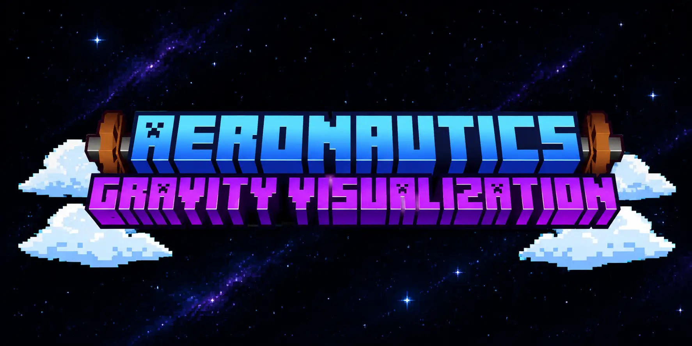

<p align="center">
  
</p>

<h1 align="center">Aeronautics Suite</h1>

<p align="center">
  A <b>Create Aeronautics</b> add-on pack for Minecraft 1.21.1 / NeoForge.<br/>
  Three mods in one jar — gravity visualization, convenience tweaks, and starlight logistics — for tuning Sable physics on contraptions and beyond.
</p>

<p align="center">
  English | <a href="README.zh_CN.md">简体中文</a>
</p>

---

## One jar, three mods

The suite ships as a single jar that registers **three mods** — each is independently loadable/disablable but shares mixins and config:

| Mod ID | Name | Features |
|---|---|---|
| `gravity_visualization` | Aeronautics: Gravity Visualization | Spark Wand, Portable Diagram, Counterweight / Counterweight-Light blocks |
| `simplification_related` | Aeronautics: Simplification Related | Convenient Analog Transmission, Variable Speed Portable Engine, Sequential Feeder |
| `starlight_logistics` | Aeronautics: Starlight Logistics | Starlight Fluid + Void Hose Pulley, Lightweight/Ultralight Glass, Starlight Casing, Stabilizer, World Anchor, Addressing Sign, Activated Ender Pearl |

### In-game config

A **config screen** (Create's Catnip UI) is attached to all three mods' mod-list buttons. Every feature and every starlight recipe group can be toggled on/off independently (all on by default). Disabling a feature:
- Removes its **crafting recipes** (a custom `feature_enabled` recipe condition).
- **Deletes the item the moment a player picks it up** (placed blocks keep working; only acquisition + crafting are gated). An actionbar message tells the player.

## Features

### Mass Visualizer
Right-click a contraption with the **Spark Wand** to overlay per-block mass numbers and a center-of-mass crosshair.
- **Normal mode**: shows surface blocks with mass > 0, with occlusion culling so numbers don't clutter through walls.
- **Heavy mode** (Shift + right-click): shows *all* blocks with mass ≥ 2, ignoring occlusion — for trim and balance analysis.

### Convenient Analog Transmission
A redstone-to-rotation converter. Outputs a **fixed RPM from a lookup table** based on a 0–15 redstone signal, ignoring input speed. Behaves as a clutch at signal 0; a compact way to drive contraptions from redstone.

### Counterweight Blocks
Tune Sable physics properties per-block, in two families:

| Family | How to adjust | Blocks | Range |
|---|---|---|---|
| **Manual** | Scroll-value board (right-click empty-handed) | counterweight, counterweight_light (+ skins) | mass 1–20, buoyancy 1–36 |
| **Redstone** | Neighbor redstone signal 0–15 | counterweight_redstone, counterweight_light_redstone (+ skins) | tier 1–16 |

The redstone family has no value board — its lamp band tints by signal so you can read the tier at a glance (red = down force, cyan = buoyancy). Goggles also show the current tier.

### Lightweight / Ultralight Glass
Low-mass glass for shedding weight off contraptions, with connected textures (panes merge visually).
- **Lightweight Glass**: 0.25 kpg (¼ of vanilla glass).
- **Ultralight Glass**: 0.125 kpg, `fragile` — breaks on impact.

### Stabilizer Block
A self-stabilizing block that keeps a contraption **level without interfering with yaw steering**.
- PD controller with gain scheduling on tilt speed: gentle response on slow tilt, early response on fast tilt (beats the 45° physics-failure limit).
- Auto-switches between **mass mode** (high end, down force) and **lift mode** (low end, up force) based on position relative to the center of mass.
- Adjustable deadband (0–30°, per side face) and redstone-controllable (top/bottom faces: active when unpowered / powered).

### Spark Wand
The mass visualizer trigger — and a combat item:
- Deals fire damage (burns visually, no lingering flames on non-lethal hits; cooks drops on lethal hits).
- **Creeper Buster** enchantment (enchant table): one-shot creepers.
- Doubles as **Create goggles** when held — shows kinetic stress overlays and aim info.

## Dependencies

| Mod | Version |
|---|---|
| Minecraft | 1.21.1 |
| NeoForge | 21.1.235 |
| Create | ≥ 6.0.10 |
| Sable | ≥ 2.0.0 |
| Simulated | ≥ 1.3.0 |
| Aeronautics | ≥ 1.3.0 |

## Installation

Drop the jar into your client/server `mods/` folder alongside the dependencies above.

## Building

```bash
./gradlew build
```

The output jar will be in `build/libs/`.

## License

Released under the [MIT License](LICENSE).
